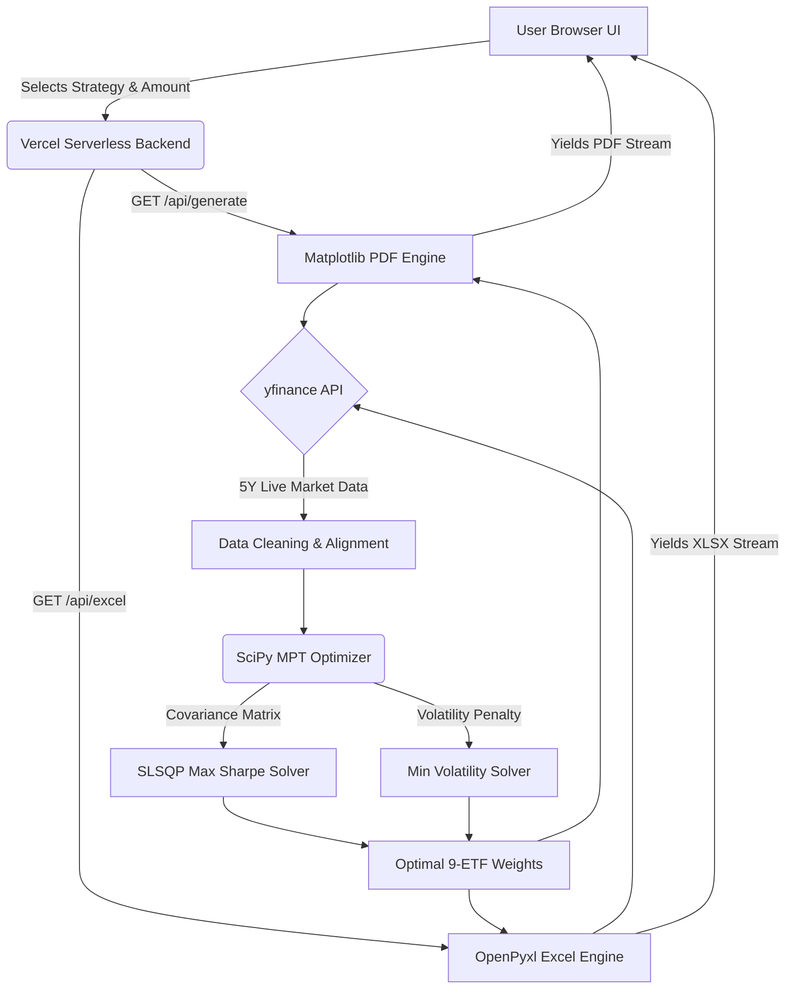

# 📊 Indian ETF Robo-Advisor & Portfolio Optimization (v3.0)

**Live Dashboard:** [https://web-six-zeta-72.vercel.app](https://web-six-zeta-72.vercel.app)
*(Live NSE ETF prices · On-demand PDF & Excel Generation via Vercel Serverless API)*

An end-to-end quantitative finance Robo-Advisor built in Python. This platform applies **Modern Portfolio Theory (MPT)** to a diversified 9-ETF universe covering Indian Equities, US Equities, Gold, Silver, and Government Securities. It features live data ingestion, constrained portfolio optimization, and institutional-grade dynamic reporting — all deployed as a full-stack serverless web application.

> Built as part of preparation for the **NISM Research Analyst (RA Series 15)** examination.

---

## 🏗 End-to-End System Architecture

This flowchart illustrates the end-to-end data pipeline from user input to final report delivery:



---

## ⚙️ Core Engineering Highlights

### 1. The 9-ETF MPT Optimizer
At the core of the backend is the `scipy.optimize.minimize` algorithm. It ingests 5 years of daily returns across a highly diversified 9-ETF universe (NIFTYBEES, JUNIORBEES, MID150BEES, MON100, GOLDBEES, SILVERBEES, SETF10GILT, BANKBEES, LIQUIDBEES). 
The optimizer uses the **SLSQP (Sequential Least SQuares Programming)** method to maximize the Sharpe ratio, strictly enforcing boundaries so no single asset exceeds a 45% weight and the weights sum perfectly to 1.

### 2. Serverless Matplotlib PDF Engine
Instead of relying on third-party SaaS services for reporting, the backend uses a bespoke PDF generator (`matplotlib.backends.backend_pdf`). It plots the Efficient Frontier, Correlation Heatmaps, and 12-Month Rolling Return charts completely in memory (headless), streaming them directly to a PDF buffer.

### 3. Automated Excel Portfolio Wealth Model
For financial modeling, the API integrates `openpyxl` to dynamically construct an Excel workbook based on the user's investment amount and strategy. It generates a three-statement model:
*   **Portfolio Beta Calculator:** Calculates live Weighted Beta against the Nifty 50.
*   **10-Year Projection Schedule:** Forecasts compounding wealth based on expected returns.
*   **Cash Flow Schedule:** Models expected annual dividend yields for the basket.

---

## 📁 Project Structure

```
.
├── notebooks/
│   ├── 01_exploratory_analysis.ipynb
│   └── v-02_exploratory_analysis.ipynb   # v3 Final 9-ETF MPT source code
├── web/                                  # Vercel serverless full-stack app
│   ├── index.html / style.css / main.js  # Glassmorphism Frontend UI
│   └── api/
│       ├── generate.py                   # Vercel API: PDF Endpoint
│       ├── mpt_generator.py              # PDF Matplotlib drawing logic
│       ├── excel.py                      # Vercel API: Excel Endpoint
│       ├── excel_generator.py            # Excel Openpyxl generation logic
│       └── prices.py                     # Live price fetching API
├── generate_final_docs.py                # Generates the Architecture HTML Manual
└── requirements.txt                      # Pinned Python dependencies
```

---

## 🔬 Strategic Insight

The analysis demonstrates that naive equal-weighting is sub-optimal. By exploiting the low correlation between Indian Equities, US Equities (Nasdaq 100), and Commodities (Gold/Silver), the optimizer achieves a significantly higher Sharpe ratio while keeping volatility in check.

---

## ▶️ Setup & Execution

```bash
# 1. Install dependencies
pip install -r requirements.txt

# 2. Run the development server locally (requires Vercel CLI)
cd web && npx vercel dev

# 3. View the Architecture Manual
python generate_final_docs.py
# (Outputs to ./output/ETF_Quant_Final_Architecture_Manual.html)
```

---

##  Skills Demonstrated

`Python` · `NumPy` · `Pandas` · `SciPy` · `Matplotlib` · `OpenPyxl` · `yfinance` · `Modern Portfolio Theory` · `Portfolio Optimization` · `REST API` · `Vercel Serverless` · `JavaScript` · `HTML/CSS` · `NISM RA Series 15`

---

## ⚠️ Disclaimer
This project is for **educational and research purposes only**. It does not constitute investment advice. Past performance is not indicative of future results. Please consult a SEBI-registered investment advisor before making investment decisions.
